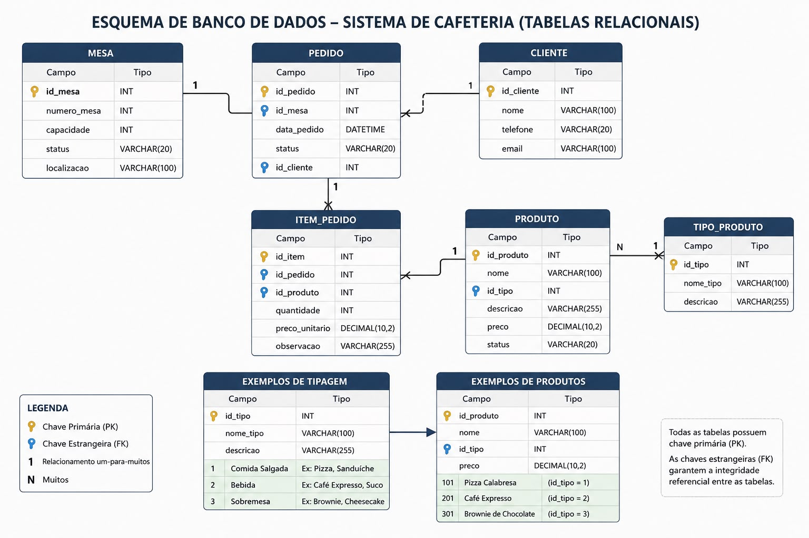
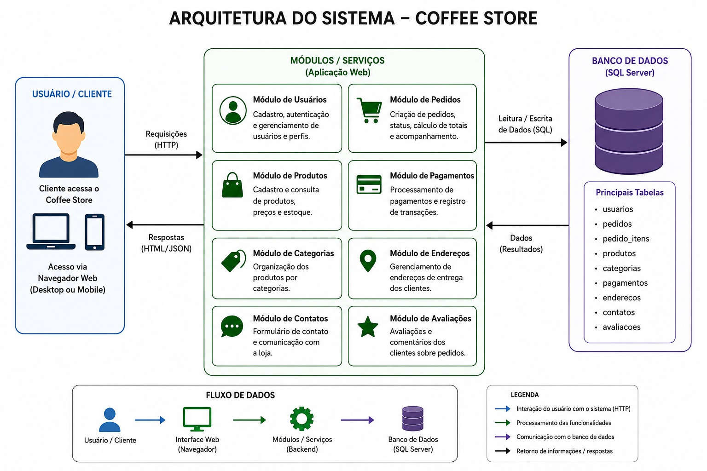

# ☕ Café & Sabor — Sistema de Reservas

Sistema web desenvolvido para uma atividade acadêmica com o objetivo de simular o processo de reserva de mesas em uma cafeteria.

O projeto utiliza **Python com Flask** no backend e **HTML e CSS** no frontend, seguindo uma **arquitetura monolítica**.

---

## 📌 Sobre o projeto

O sistema permite que o usuário:

* Acesse a página inicial da cafeteria;
* Acesse a página de reservas;
* Preencha seus dados;
* Informe a data e o horário da reserva;
* Informe a quantidade de pessoas;
* Adicione uma observação, caso necessário;
* Envie a reserva através de um formulário `POST`;
* Visualize uma tela de confirmação com os dados informados.

---

## 🎯 Objetivo

Desenvolver uma aplicação web simples aplicando conceitos de:

* Desenvolvimento Web;
* Backend com Flask;
* Rotas;
* Formulários HTML;
* Método HTTP `POST`;
* Recebimento e processamento de dados;
* Templates;
* Arquitetura Monolítica;
* Git e GitHub.

---

## 🛠️ Tecnologias utilizadas

### Backend

* Python
* Flask

### Frontend

* HTML5
* CSS3

### Ferramentas

* Git
* GitHub
* Visual Studio Code

---

## 🏗️ Arquitetura

O projeto utiliza uma **arquitetura monolítica**, na qual os componentes da aplicação estão concentrados em um único projeto.

O Flask é responsável por:

* Gerenciar as rotas;
* Servir as páginas HTML;
* Receber os dados do formulário;
* Processar os dados enviados;
* Exibir a confirmação da reserva.

### Fluxo principal

```text
Usuário
   │
   ▼
Página Inicial
   │
   ▼
Página de Reserva
   │
   │ POST
   ▼
Flask / app.py
   │
   ▼
Processamento dos dados
   │
   ▼
Tela de Confirmação
```

---

## 🚀 Funcionalidades

### Página inicial

Apresenta informações sobre a cafeteria e disponibiliza acesso à página de reservas.

### Reserva

O usuário pode informar:

* Nome completo;
* Data da reserva;
* Horário;
* Número de pessoas;
* Observações.

### Confirmação

Após o envio do formulário, o sistema apresenta os dados informados pelo usuário em uma tela de confirmação.

---

## 📂 Estrutura do projeto

```text
coffee-store/
│
├── app.py
├── requirements.txt
├── .gitignore
├── README.md
│
├── templates/
│   ├── index.html
│   ├── reserva.html
│   └── confirmacao.html
│
├── static/
│   └── style.css
│
└── docs/
    └── der.png
```

---

## ⚙️ Como executar o projeto

### 1. Clonar o repositório

```bash
git clone https://github.com/douglassud21/coffee-store.git
```

Entre na pasta:

```bash
cd coffee-store
```

### 2. Criar um ambiente virtual

No Windows:

```bash
python -m venv venv
```

Ative o ambiente virtual:

```bash
venv\Scripts\activate
```

### 3. Instalar as dependências

```bash
pip install -r requirements.txt
```

### 4. Executar a aplicação

```bash
python app.py
```

### 5. Acessar no navegador

```text
http://127.0.0.1:5000/
```

---

## 🔄 Rotas do sistema

| Método | Rota           | Função                                    |
| ------ | -------------- | ----------------------------------------- |
| GET    | `/`            | Página inicial                            |
| GET    | `/reserva`     | Formulário de reserva                     |
| POST   | `/confirmacao` | Recebe os dados e apresenta a confirmação |

---

## 📤 Envio dos dados

O formulário de reserva utiliza o método HTTP `POST`.

Exemplo:

```html
<form action="/confirmacao" method="POST">
```

Os dados são recebidos no Flask através de:

```python
nome = request.form.get("nome")
data = request.form.get("data")
horario = request.form.get("horario")
pessoas = request.form.get("pessoas")
observacao = request.form.get("observacao")
```

Após o processamento, os dados são enviados para a página de confirmação.

---

## 🧪 Testes

Para testar o sistema:

1. Acesse a página inicial;
2. Clique em **Fazer uma reserva**;
3. Preencha todos os campos obrigatórios;
4. Clique em **Confirmar reserva**;
5. Verifique se a página de confirmação apresenta corretamente os dados informados.

### Cenário esperado

```text
Nome: Douglas Nascimento
Data: 20/08/2026
Horário: 19:00
Pessoas: 4
Observação: Mesa próxima à janela
```

O sistema deve apresentar essas informações na tela de confirmação.

---

## 📐 Documentação

### Diagrama Entidade-Relacionamento (DER)

O DER representa a estrutura do banco de dados e o relacionamento entre suas entidades.



### Arquitetura do Sistema

O diagrama de arquitetura apresenta a organização e o fluxo dos principais componentes do sistema.



---

## 👥 Equipe

| Integrante                  | RM    | Responsabilidade                                                            |
| --------------------------- | ----: | --------------------------------------------------------------------------- |
| Douglas Silva Nascimento    | 22873 | Backend, Flask, rotas, formulário POST, recebimento dos dados e confirmação |
| Allan Gabriel Sousa Palma   | 22544 | HTML, CSS e navegação entre páginas                                         |
| Vitória de Carvalho Esteves | 21684 | Arquitetura monolítica, diagrama, evento principal e reações automatizadas  |
| Gustavo Gomes Pecora        | 22767 | GitHub, documentação, DER, testes e organização da apresentação             |

---

## 📚 Projeto acadêmico

Projeto desenvolvido como atividade acadêmica para aplicação prática dos conceitos de desenvolvimento web, arquitetura de software, Git/GitHub e integração entre frontend e backend.

---

**☕ Café & Sabor — Sistema de Reservas**
