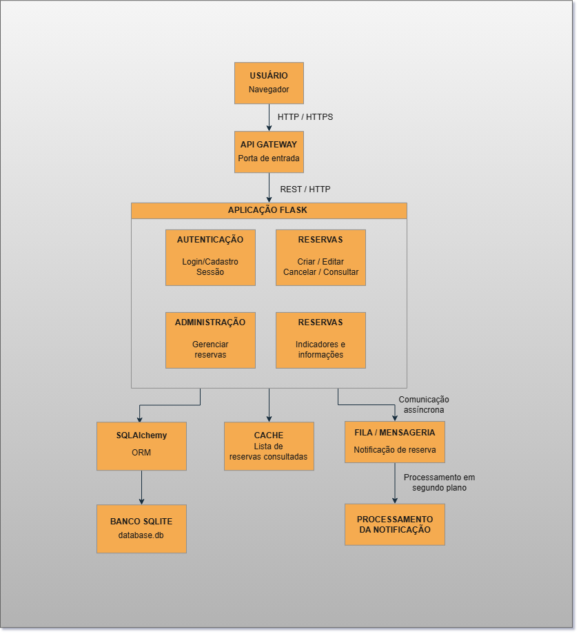

# ☕ Café & Sabor — Sistema de Reservas

Sistema web desenvolvido para uma atividade acadêmica com o objetivo de simular o processo de reserva de mesas em uma cafeteria.

O projeto utiliza **Python com Flask** no backend e **HTML e CSS** no frontend, seguindo uma **arquitetura monolítica**.

---

## 📌 Sobre o projeto

O sistema permite que o usuário:

* Acesse a página inicial da cafeteria;
* Acesse a página de reservas;
* Preencha seus dados;
* Informe a data e o horário da reserva;
* Informe a quantidade de pessoas;
* Adicione uma observação, caso necessário;
* Envie a reserva através de um formulário `POST`;
* Visualize uma tela de confirmação com os dados informados;
* Visualize a lista de reservas cadastradas;
* Pesquise reservas pelo nome;
* Altere o status das reservas cadastradas.

---

## Descrição Geral

O objetivo do sistema **Café & Sabor** é auxiliar no gerenciamento de reservas de mesas em uma cafeteria, permitindo que os usuários realizem reservas e consultem suas informações de forma organizada.

A aplicação centraliza o cadastro, validação, armazenamento, consulta e alteração do status das reservas, facilitando o controle das informações pela cafeteria.

---

## Requisitos Funcionais

**RF01** | **Realizar reserva:** o sistema deve permitir cadastrar uma reserva informando nome completo, data, horário, quantidade de pessoas, categoria e observações.

**RF02** | **Confirmar reserva:** o sistema deve permitir visualizar os dados cadastrados e confirmar a realização da reserva.

**RF03** | **Listar reservas:** o sistema deve exibir as reservas cadastradas, incluindo o ID, nome, categoria, data, horário, quantidade de pessoas e status.

**RF04** | **Alterar status:** o sistema deve permitir alterar o status da reserva entre **Pendente, Confirmada e Concluída**.

**RF05** | **Excluir reserva:** o sistema deve permitir excluir definitivamente uma reserva pelo seu ID.

**RF06** | **Pesquisar reservas:** o sistema deve permitir pesquisar reservas pelo nome do cliente ou categoria da reserva.

**RF07** | **Validar reservas:** o sistema deve impedir o cadastro de informações inválidas, como campos obrigatórios vazios, quantidade de pessoas menor ou igual a zero, data/horário inválidos ou data passada.

**RF08** | **Exibir informações gerais:** a página inicial deve apresentar indicadores como total de reservas, reservas confirmadas e total de pessoas.

**RF09** | **Persistir dados:** o sistema deve armazenar as reservas em banco de dados SQLite, mantendo os dados mesmo após o encerramento e reinício do servidor.

---

## Requisitos Não Funcionais

| **RNF01** | **Desempenho:** o sistema deve realizar consultas, cadastros, alterações, exclusões e pesquisas de reservas de forma rápida e eficiente.                                          |
| --------- | --------------------------------------------------------------------------------------------------------------------------------------------------------------------------------- |
| **RNF02** | **Disponibilidade:** o sistema deve poder permanecer em execução continuamente, permitindo acesso às funcionalidades durante o período em que o servidor estiver disponível.      |
| **RNF03** | **Persistência:** os dados devem ser armazenados em banco de dados SQLite, não dependendo de listas ou variáveis temporárias em memória.                                          |
| **RNF04** | **Segurança dos dados:** informações dos usuários e das reservas devem ser armazenadas de forma adequada, evitando o versionamento do banco de dados e de arquivos `.env` no Git. |
| **RNF05** | **Manutenibilidade:** o sistema deve utilizar uma estrutura organizada, separando aplicação, rotas, modelos, banco de dados e templates.                                          |
| **RNF06** | **Usabilidade:** as mensagens de validação e erro devem ser claras para facilitar o preenchimento e a utilização do sistema.                                                      |
| **RNF07** | **Portabilidade:** cada máquina deve conseguir criar seu próprio banco de dados local por meio do `db.create_all()`, sem depender do arquivo de banco enviado pelo GitHub.        |

---

## Dados dos usuários que o sistema deve proteger

O sistema deve proteger principalmente os dados pessoais utilizados no cadastro e nas reservas, como:

* Nome completo;
* E-mail;
* Telefone;
* Dados relacionados às reservas realizadas.

O banco de dados e arquivos que possam conter informações sensíveis não devem ser enviados ao repositório do GitHub.

---

## Eventos do sistema

| Evento                           | Ator    | Ação                                          | Resposta do Sistema                                                        |
| -------------------------------- | ------- | --------------------------------------------- | -------------------------------------------------------------------------- |
| **E01 – Acessar página inicial** | Usuário | Acessa `/`                                    | Sistema carrega o painel e apresenta os indicadores de reservas.           |
| **E02 – Iniciar reserva**        | Usuário | Clica em **Reservar**                         | Sistema apresenta o formulário de reserva.                                 |
| **E03 – Enviar reserva**         | Usuário | Preenche o formulário e envia                 | Sistema recebe os dados via `POST` e inicia as validações.                 |
| **E04 – Dados inválidos**        | Sistema | Identifica campo vazio ou informação inválida | Sistema impede o cadastro e apresenta uma mensagem de erro.                |
| **E05 – Reserva válida**         | Sistema | Valida todos os dados corretamente            | Sistema cria um novo registro `Reserva` com status **Pendente**.           |
| **E06 – Salvar reserva**         | Sistema | Executa a persistência dos dados              | Reserva é armazenada no banco SQLite.                                      |
| **E07 – Confirmar cadastro**     | Sistema | Reserva foi salva com sucesso                 | Sistema apresenta a página de confirmação com os dados da reserva.         |
| **E08 – Consultar reservas**     | Usuário | Acessa a lista de reservas                    | Sistema consulta os registros e apresenta a tabela.                        |
| **E09 – Pesquisar reserva**      | Usuário | Digita um nome ou categoria                   | Sistema realiza a pesquisa e apresenta os resultados correspondentes.      |
| **E10 – Alterar status**         | Usuário | Clica no botão de alteração de status         | Sistema altera o status da reserva e salva a alteração no banco.           |
| **E11 – Concluir reserva**       | Usuário | Altera uma reserva Confirmada                 | Sistema muda o status para **Concluída**.                                  |
| **E12 – Excluir reserva**        | Usuário | Clica em excluir                              | Sistema solicita confirmação da exclusão.                                  |
| **E13 – Confirmar exclusão**     | Usuário | Confirma a exclusão                           | Sistema localiza a reserva pelo ID, exclui o registro e salva a alteração. |
| **E14 – Cancelar exclusão**      | Usuário | Cancela a exclusão                            | Sistema mantém a reserva cadastrada.                                       |
| **E15 – Reiniciar servidor**     | Sistema | Aplicação é executada novamente               | Sistema utiliza o banco SQLite existente e mantém os dados cadastrados.    |

---

## 🎯 Objetivo

Desenvolver uma aplicação web simples aplicando conceitos de:

* Desenvolvimento Web;
* Backend com Flask;
* Rotas;
* Formulários HTML;
* Método HTTP `POST`;
* Método HTTP `GET`;
* Recebimento e processamento de dados;
* Templates;
* Validação de dados;
* Métricas;
* Manipulação de estados;
* Pesquisa e filtragem de dados;
* Arquitetura Monolítica;
* Componentes de comunicação;
* API REST;
* Comunicação síncrona;
* Comunicação assíncrona;
* Estratégias de cache;
* Git e GitHub.

---

## 🛠️ Tecnologias utilizadas

### Backend

* Python
* Flask

### Frontend

* HTML5
* CSS3

### Banco de dados

* SQLite

### Ferramentas

* Git
* GitHub
* Visual Studio Code

---

# 🏗️ Arquitetura

O projeto utiliza uma **arquitetura monolítica**, na qual os principais componentes da aplicação estão concentrados em um único projeto.

Para a evolução da arquitetura apresentada nesta entrega, são considerados componentes de comunicação que permitem melhorar a organização, o desempenho e a comunicação entre o usuário e a aplicação.

O **API Gateway** é utilizado como ponto de entrada das requisições, direcionando as solicitações para os componentes responsáveis pelo processamento.

O **Cache** é utilizado como estratégia de otimização para informações que são consultadas frequentemente, reduzindo consultas repetitivas ao banco de dados.

### Componentes principais

* **Usuário:** realiza as interações com o sistema através do navegador.
* **API Gateway:** atua como ponto de entrada das requisições e direciona as solicitações para a aplicação.
* **Aplicação Flask:** responsável pelas rotas, regras de negócio e processamento das requisições.
* **Banco de dados SQLite:** responsável pela persistência das informações.
* **Cache:** armazena temporariamente informações consultadas com frequência para melhorar o tempo de resposta.
* **Fila/Mensageria:** representa o mecanismo utilizado para executar tarefas que não precisam bloquear a resposta ao usuário.

### Fluxo principal

```text
Usuário
   │
   ▼
API Gateway
   │
   ▼
Aplicação Flask
   │
   ├──────────────► Cache
   │
   ▼
Banco de Dados SQLite
```

O diagrama de componentes completo está apresentado na seção de documentação.

---

## 🗂️ Estratégia de Cache

O **Cache** será utilizado para armazenar temporariamente informações que são consultadas com frequência e que não precisam ser buscadas no banco de dados a cada requisição.

No sistema Café & Sabor, uma aplicação possível é utilizar o cache para as **métricas apresentadas na página inicial**, como:

* Total de reservas;
* Total de reservas confirmadas;
* Total de pessoas.

Quando o usuário acessar a página inicial, o sistema poderá verificar primeiro se essas informações estão disponíveis no cache.

### Fluxo do Cache

```text
Usuário
   │
   ▼
API Gateway
   │
   ▼
Aplicação Flask
   │
   ▼
Verifica Cache
   │
   ├── Informação disponível
   │          │
   │          ▼
   │     Retorna informação
   │
   └── Informação não disponível
              │
              ▼
        Consulta banco
              │
              ▼
        Atualiza Cache
              │
              ▼
        Retorna informação
```

Essa estratégia reduz consultas repetitivas ao banco de dados e pode melhorar o tempo de resposta da aplicação.

**Observação:** o uso do Cache nesta documentação representa uma estratégia arquitetural proposta para evolução do sistema.

---

# 🔄 Fluxos de Comunicação

## 1. Comunicação Síncrona — API REST

A comunicação síncrona será utilizada em funcionalidades que precisam de uma resposta imediata para que o usuário possa continuar sua interação com o sistema.

Um exemplo real é o **cadastro de uma reserva**.

### Fluxo

```text
Usuário
   │
   │ POST /confirmacao
   ▼
API Gateway
   │
   ▼
Aplicação Flask
   │
   ▼
Validação dos dados
   │
   ▼
Banco de Dados
   │
   ▼
Reserva salva
   │
   ▼
Resposta HTTP
   │
   ▼
Usuário recebe confirmação
```

Nesse fluxo, o usuário aguarda a resposta da aplicação para saber se a reserva foi cadastrada corretamente.

A comunicação é considerada **síncrona** porque a resposta da aplicação é necessária imediatamente para continuar o processo.

### Exemplo

```text
POST /confirmacao
```

O sistema recebe os dados da reserva, realiza as validações, salva as informações e retorna a página de confirmação.

---

## 2. Comunicação Assíncrona — Fila/Mensageria

A comunicação assíncrona será utilizada para tarefas que podem ser executadas em segundo plano e que não precisam bloquear a navegação do usuário.

Um exemplo é o **envio de uma notificação de confirmação da reserva**.

### Fluxo

```text
Usuário
   │
   ▼
API Gateway
   │
   ▼
Aplicação Flask
   │
   ▼
Banco de Dados
   │
   ▼
Reserva cadastrada
   │
   ├──────────────► Fila de Mensagens
   │                       │
   ▼                       ▼
Confirmação            Processamento
para usuário           em segundo plano
                               │
                               ▼
                       Envio de notificação
```

Nesse caso, após salvar a reserva, a aplicação pode enviar uma mensagem para uma fila.

O usuário recebe a confirmação da reserva sem precisar esperar o processamento da notificação.

A tarefa de envio da mensagem pode ser executada posteriormente por um processo em segundo plano.

**Observação:** a fila/mensageria apresentada neste documento representa uma proposta de evolução arquitetural e não significa que um serviço externo de mensageria já esteja implementado no sistema atual.

---

# 🚀 Funcionalidades

## Página inicial

Apresenta informações sobre a cafeteria e disponibiliza acesso à página de reservas.

A página inicial também apresenta métricas:

* Total de reservas;
* Reservas confirmadas;
* Total de pessoas.

---

## Reserva

O usuário pode informar:

* Nome completo;
* Data da reserva;
* Horário;
* Número de pessoas;
* Categoria da reserva;
* Observações.

---

## Confirmação

Após o envio do formulário, o sistema apresenta os dados informados pelo usuário em uma tela de confirmação.

---

## Validações

O sistema realiza validações dos dados antes de salvar uma reserva.

São verificadas as seguintes situações:

* Campos obrigatórios vazios;
* Nome inválido;
* Número de pessoas não numérico;
* Número de pessoas igual ou menor que zero;
* Número de pessoas acima de 20;
* Data ou horário inválidos;
* Data da reserva no passado.

Caso algum dado seja inválido, a reserva não é cadastrada e uma mensagem de erro é apresentada ao usuário.

---

## Métricas

O sistema apresenta três métricas principais:

* Total de reservas;
* Reservas confirmadas;
* Total de pessoas.

As métricas são obtidas a partir das reservas armazenadas no banco de dados.

Como estratégia de otimização arquitetural, essas informações podem ser armazenadas temporariamente em **Cache**, reduzindo consultas repetitivas ao banco de dados.

---

## Lista de Reservas

O sistema possui uma página para visualizar as reservas cadastradas.

A lista apresenta informações como:

* ID;
* Nome;
* Categoria;
* Data;
* Horário;
* Número de pessoas;
* Status.

---

## Pesquisa

A lista de reservas possui uma ferramenta de pesquisa que permite localizar uma reserva pelo nome do cliente ou categoria.

A pesquisa utiliza o método HTTP `GET`.

---

## Alteração de Status

Cada reserva possui um status.

Ao ser cadastrada, a reserva recebe inicialmente o status:

**Pendente**

O status pode ser alterado para:

**Confirmada**

e posteriormente:

**Concluída**

A alteração do status não exclui a reserva do sistema.

---

# 📂 Estrutura do projeto

```text
coffee-store/
│
├── app.py
├── requirements.txt
├── .gitignore
├── README.md
│
├── templates/
│   ├── index.html
│   ├── reserva.html
│   ├── confirmacao.html
│   └── lista_reservas.html
│
├── static/
│   └── style.css
│
└── docs/
    ├── der.png
    └── diagrama_componentes.png
```

---

# ⚙️ Como executar o projeto

### 1. Clonar o repositório

```bash
git clone https://github.com/douglassud21/coffee-store.git
```

Entre na pasta:

```bash
cd coffee-store
```

### 2. Criar um ambiente virtual

No Windows:

```bash
python -m venv venv
```

Ative o ambiente virtual:

```bash
venv\Scripts\activate
```

### 3. Instalar as dependências

```bash
pip install -r requirements.txt
```

### 4. Executar a aplicação

```bash
python app.py
```

### 5. Acessar no navegador

```text
http://127.0.0.1:5000/
```

---

# 🔄 Rotas do sistema

| Método | Rota                 | Função                               |
| ------ | -------------------- | ------------------------------------ |
| GET    | `/`                  | Página inicial                       |
| GET    | `/reserva`           | Formulário de reserva                |
| POST   | `/confirmacao`       | Recebe os dados e processa a reserva |
| GET    | `/reservas`          | Lista e pesquisa as reservas         |
| POST   | `/mudar-status/<id>` | Altera o status da reserva           |

---

# 📤 Envio dos dados

O formulário de reserva utiliza o método HTTP `POST`.

Exemplo:

```html
<form action="/confirmacao" method="POST">
```

Os dados são recebidos no Flask através do formulário e processados pela aplicação.

Após a validação e o cadastro, os dados são utilizados para apresentar a confirmação da reserva.

---

# 🛡️ Validações

Antes de salvar uma reserva, o sistema realiza validações dos dados recebidos.

Os campos obrigatórios são verificados para garantir que não estejam vazios.

O número de pessoas também é validado para garantir que:

* Seja um valor numérico;
* Seja maior que zero;
* Não ultrapasse o limite de 20 pessoas.

O nome também é validado para garantir que seja informado corretamente.

Quando uma informação inválida é identificada, o sistema impede o cadastro e apresenta uma mensagem amigável ao usuário.

Exemplos de valores inválidos:

```text
Pessoas: 0
```

```text
Pessoas: -1
```

```text
Pessoas: abc
```

---

# 📊 Métricas

As métricas apresentadas na página inicial são obtidas a partir das reservas cadastradas no sistema.

São apresentadas:

```text
Total de reservas
Reservas confirmadas
Total de pessoas
```

Essas informações são enviadas para o template da página inicial e apresentadas nos cards do dashboard.

Como melhoria de desempenho, a arquitetura proposta prevê a utilização de **Cache** para evitar consultas repetitivas ao banco de dados quando essas informações forem solicitadas com frequência.

---

# 🔄 Manipulação de estados

Cada reserva possui um status.

O status inicial de uma nova reserva é:

```text
Pendente
```

Após a análise da reserva, ela pode ser alterada para:

```text
Confirmada
```

Depois de realizada, pode ser alterada para:

```text
Concluída
```

A alteração do status não exclui a reserva do sistema.

---

# 🔎 Pesquisa e filtragem

A página de reservas permite realizar pesquisas utilizando o método HTTP `GET`.

Exemplo:

```text
/reservas?busca=douglas
```

O sistema verifica as reservas cadastradas e apresenta os resultados correspondentes à pesquisa.

---

# 🧪 Testes

Para testar o sistema:

1. Acesse a página inicial;
2. Clique em **Fazer uma reserva**;
3. Preencha todos os campos obrigatórios;
4. Clique em **Confirmar reserva**;
5. Verifique se a página de confirmação apresenta corretamente os dados informados;
6. Acesse a página de **Lista de Reservas**;
7. Verifique se a reserva cadastrada aparece na lista;
8. Utilize a pesquisa pelo nome;
9. Utilize o botão **Mudar Status**;
10. Verifique se o status da reserva foi alterado;
11. Retorne à página inicial e verifique se as métricas foram atualizadas.

### Cenário esperado

```text
Nome: Douglas Nascimento
Data: 20/08/2026
Horário: 19:00
Pessoas: 4
Observação: Mesa próxima à janela
```

O sistema deve apresentar essas informações na tela de confirmação.

### Testes de validação

Também foram realizados testes com valores inválidos.

Exemplo:

```text
Pessoas: 0
```

O sistema deve impedir o cadastro e apresentar uma mensagem informando que o número de pessoas deve ser maior que zero.

Outro teste:

```text
Pessoas: -1
```

O sistema também deve impedir o cadastro.

Também é realizado o teste com um valor não numérico:

```text
Pessoas: abc
```

Nesse caso, o sistema deve informar que o número de pessoas precisa ser um valor válido.

---

# 📐 Documentação

## Diagrama Entidade-Relacionamento (DER)

O DER representa a estrutura do banco de dados e o relacionamento entre suas entidades.


## Diagrama de Componentes e Comunicação

O diagrama apresenta os principais componentes da arquitetura e suas relações de comunicação, incluindo o **API Gateway**, o **Cache**, a aplicação, o banco de dados e os fluxos de comunicação.



---

# 👥 Equipe

| Integrante                  |    RM | Responsabilidade                                                            |
| --------------------------- | ----: | --------------------------------------------------------------------------- |
| Douglas Silva Nascimento    | 22873 | Backend, Flask, rotas, formulário POST, recebimento dos dados e confirmação |
| Allan Gabriel Sousa Palma   | 22544 | HTML, CSS e navegação entre páginas                                         |
| Vitória de Carvalho Esteves | 21684 | Arquitetura monolítica, diagrama, evento principal e reações automatizadas  |
| Gustavo Gomes Pecora        | 22767 | GitHub, documentação, DER, testes e organização da apresentação             |

---

# 📚 Projeto acadêmico

Projeto desenvolvido como atividade acadêmica para aplicação prática dos conceitos de desenvolvimento web, arquitetura de software, componentes, comunicação síncrona e assíncrona, estratégias de cache, Git/GitHub e integração entre frontend e backend.

---

**☕ Café & Sabor — Sistema de Reservas**
